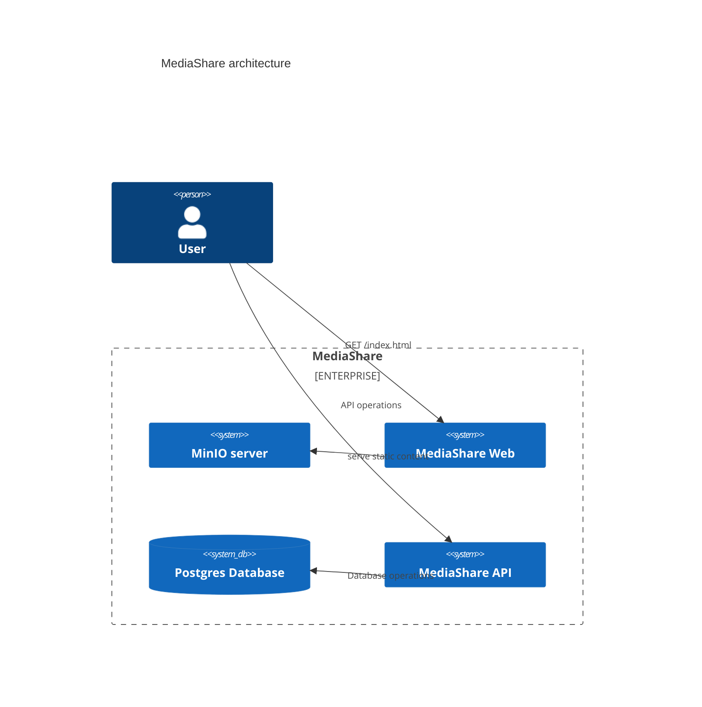
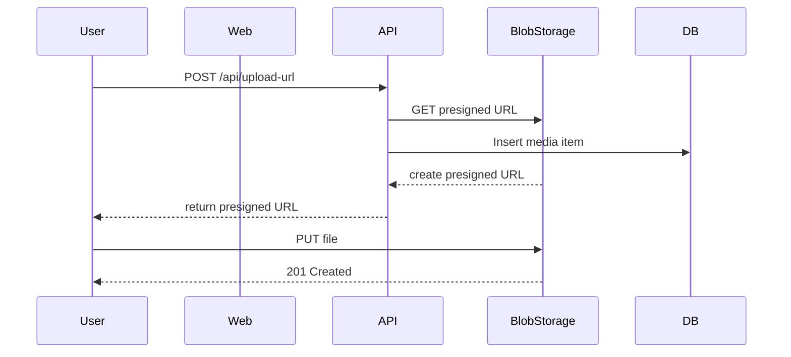
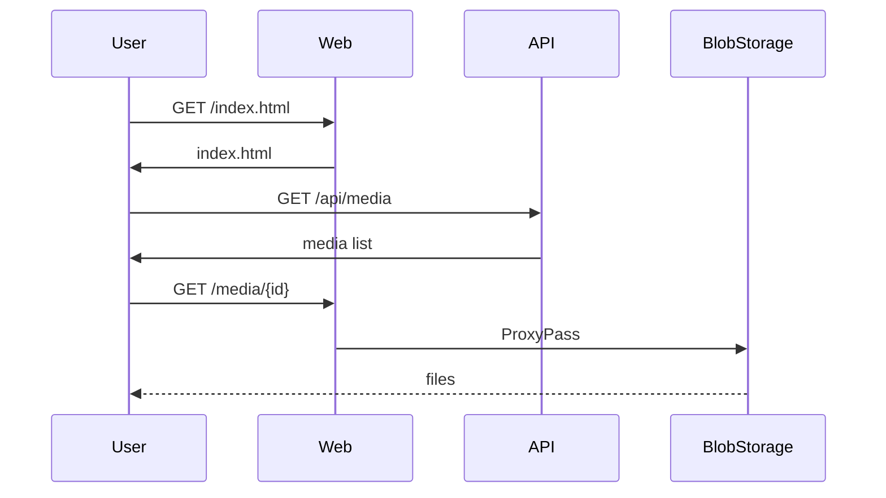
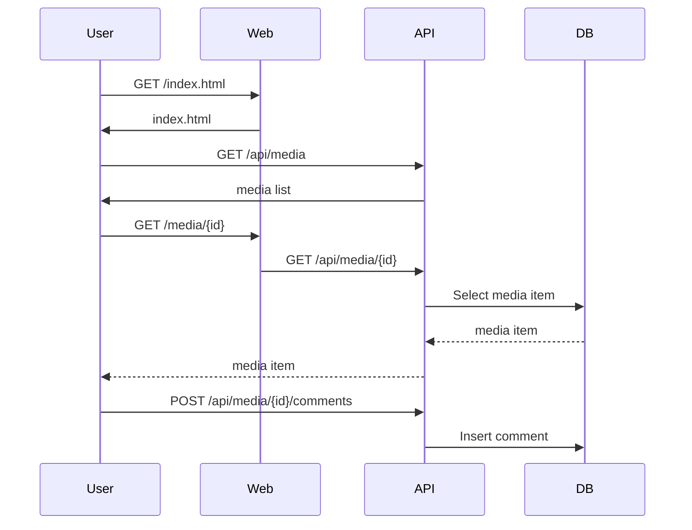

# Apex Infra Homework

## Description

This repository contains the code for the Apex Infra Homework, which is a media sharing platform built using TypeScript, React, and Hono. Your task will be to create IaC to deploy this application to AWS. You can start the app locally, using the startup.sh script. The application uses [MinIO](https://min.io/docs/minio/linux/index.html) as a storage backend, which is a drop-in replacement of S3, with S3 compatible client as well, and a Postgres database for the application data. The application allows uploading images and videos, with an uploader name and description. And it also allows commenting on uploaded content by specifying an author and a comment field.

### Tasks

* Create IaC in terraform to deploy the application to AWS
* Ensure that the application is deployed with AWS best practices in mind.
* Code changes are out of scope, the developers have not followed best practices during development, thus any alteration could lead to a problematic deployment.
* Focus on analyzing the Dockerfiles, Composefile and the provided build scripts to understand the application, along with any other non-source code files.
* It is encouraged to replace services with AWS native alternatives, wherever feasible.

### Advanced tasks

* The application is vulnerable to SQL injection attacks. Provide a solution in the AWS infrastructure to mitigate this.
* The application is vulnerable to CSRF attacks. Provide a solution in the AWS infrastructure to mitigate this.

### Architecture

The customer provided you with the following architectural diagram.

## Workflows:

### File upload:

### Visit

### Comment

